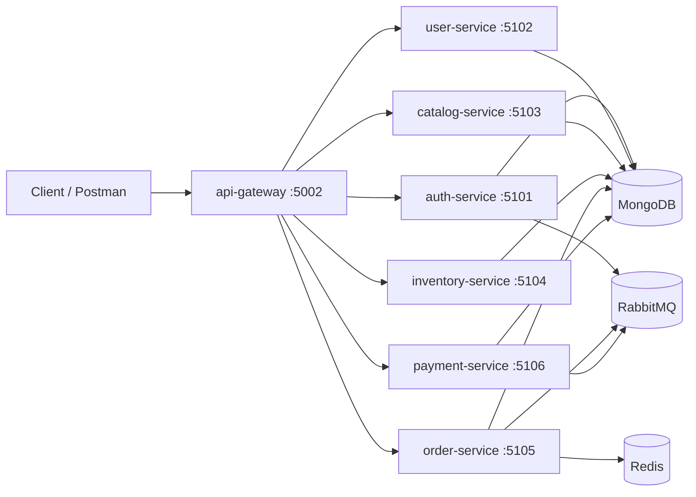

# REST API Node Microservices

This repository is now organized as a Docker-based TypeScript Express microservice system. External clients keep using the same API shape through the gateway:

```text
http://localhost:5002/api/v1/...
```

## Architecture



## Services

| Service | Port | Owned modules |
| --- | ---: | --- |
| `api-gateway` | `5002` | Downstream proxy, aggregate health checks |
| `auth-service` | `5101` | `auth`, `roles` |
| `user-service` | `5102` | `users` |
| `catalog-service` | `5103` | `brands`, `categories`, `products`, `product-variants`, `reviews`, `wishlist`, `reports` |
| `inventory-service` | `5104` | `inventory-units`, `inventory-movements`, `stock-locations`, `suppliers`, `inventory/delivery`, `activity-logs` |
| `order-service` | `5105` | `cart`, `checkout`, `orders`, `coupons` |
| `payment-service` | `5106` | `payments` |

Shared middleware, config, utilities, types, logger, and RabbitMQ event helpers live in `packages/shared/src`.

## Routing

Clients call the gateway only:

```text
Postman base URL: http://localhost:5002
API base path:    http://localhost:5002/api/v1
```

The gateway preserves existing route paths, including `/api/v1/register`, `/api/v1/login`, `/api/v1/products`, `/api/v1/cart`, `/api/v1/checkout`, `/api/v1/orders`, and `/api/v1/payments`. It also supports `/api/...` for the legacy alias used by the previous Express app.

Every service exposes:

```text
GET /health
GET /api/health
GET /api/v1/health
```

The gateway health endpoint calls all downstream service health endpoints and returns an aggregate status.

## Postman

Import these two files into Postman:

```text
docs/rest-api-node-microservices.postman_collection.json
docs/rest-api-node-local.postman_environment.json
```

Select the `REST API Node Local Gateway` environment, start the Docker Compose stack, then run `Health / Gateway aggregate health`. The `Auth Service / Login` request stores `accessToken` automatically for protected requests.
The collection also includes `Complete API URL Index`, which lists every gateway URL mounted from the migrated route files.

## Run With Docker Compose

```bash
docker compose up --build
```

Only the gateway is published to the host:

```text
http://localhost:5002
```

MongoDB, Redis, RabbitMQ, and internal services are reachable only on the Compose network.

## Local Development

Install dependencies from the repository root:

```bash
npm install
```

Run the gateway:

```bash
npm run dev
```

Run individual services:

```bash
npm run dev:auth
npm run dev:user
npm run dev:catalog
npm run dev:inventory
npm run dev:order
npm run dev:payment
```

Each service folder also supports the same scripts:

```bash
cd services/catalog-service
npm run dev
npm run build
npm run start
```

Build and typecheck the whole workspace:

```bash
npm run build
npm run typecheck
```

## Environment

Copy `.env.example` and set project-specific values.

Core variables:

```text
NODE_ENV=development
PORT=5002
MONGO_URI=mongodb://localhost:27017/rest-api-node
REDIS_URL=redis://localhost:6379
RABBITMQ_URL=amqp://localhost:5672
CORS_ORIGIN=http://localhost:5173
JWT_SECRET=replace-with-access-token-secret
JWT_REFRESH_SECRET=replace-with-refresh-token-secret
```

Per-service Mongo variables currently point at the same MongoDB instance and database. They are present so each service can move to its own database later:

```text
AUTH_MONGO_URI=
USER_MONGO_URI=
CATALOG_MONGO_URI=
INVENTORY_MONGO_URI=
ORDER_MONGO_URI=
PAYMENT_MONGO_URI=
```

Gateway downstream targets for non-Docker local runs:

```text
AUTH_SERVICE_URL=http://localhost:5101
USER_SERVICE_URL=http://localhost:5102
CATALOG_SERVICE_URL=http://localhost:5103
INVENTORY_SERVICE_URL=http://localhost:5104
ORDER_SERVICE_URL=http://localhost:5105
PAYMENT_SERVICE_URL=http://localhost:5106
```

## Events

RabbitMQ is used for cross-service domain events. Shared event names and publishing helpers are in `packages/shared/src/events`.

Current event names:

```text
user.created
order.created
payment.completed
```

If `RABBITMQ_URL` is not configured or RabbitMQ is unavailable, event publishing is skipped without failing the HTTP request.

## Migration Notes

- Business logic was moved, not rewritten. Controllers, services, repositories, models, validators, and route definitions were kept intact where possible.
- API paths are preserved behind the gateway. Clients should call `http://localhost:5002/api/v1/...`.
- The first database phase uses one MongoDB instance and connection string. Existing collection names remain service-owned by their Mongoose models.
- Some service code still imports models or services across service folders to preserve current behavior during the split. These direct imports are temporary bridge points for future HTTP/event-based service-to-service contracts.
- Reports/sidebar routes are hosted by `catalog-service` because the original router exposed them but no dedicated service was specified.
